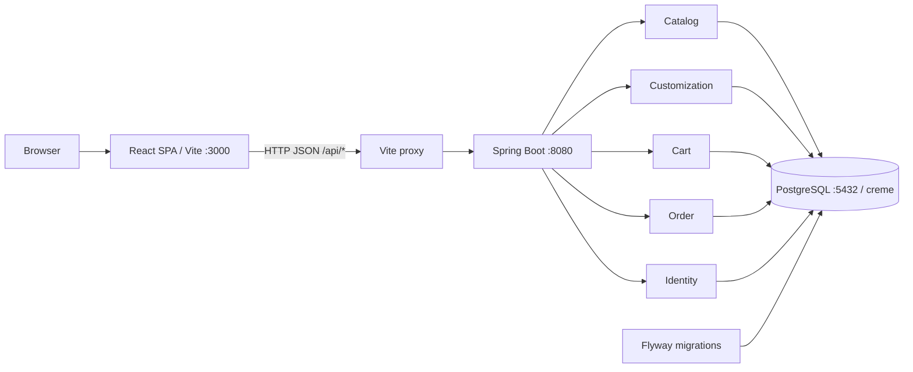

# CRÈME — Artisanal Ice Cream

**A website for discovering flavors, customizing ice cream, and placing pickup orders.**

CRÈME brings together a brand experience and an ordering flow: customers explore flavors, choose a base and toppings, select a pickup store, and submit their order. The frontend uses React and TypeScript; the backend uses Spring Boot, stores data in PostgreSQL, and manages the schema with Flyway.

The project is being developed as a **modular monolith**. Guest order creation has an implementation; login, administration, inventory, and online payments are planned next steps. This README describes the current code. The linked design documents may also cover planned features.

## Table of Contents

- [1. Overview](#1-overview)
- [2. Features and Status](#2-features-and-status)
- [3. Technology Stack](#3-technology-stack)
- [4. Architecture](#4-architecture)
- [5. Directory Structure](#5-directory-structure)
- [6. Prerequisites](#6-prerequisites)
- [7. Local Setup and Development](#7-local-setup-and-development)
- [8. Configuration](#8-configuration)
- [9. Database and Migrations](#9-database-and-migrations)
- [10. API and Usage Examples](#10-api-and-usage-examples)
- [11. Testing and Builds](#11-testing-and-builds)
- [12. Contribution Workflow](#12-contribution-workflow)
- [13. Troubleshooting](#13-troubleshooting)
- [14. Roadmap](#14-roadmap)
- [15. Documentation](#15-documentation)
- [16. Author and License](#16-author-and-license)

## 1. Overview

The project supports two main experiences:

- **Explore the menu:** browse Signature, Seasonal, and Dairy-Free flavors, and open a modal to view ingredients, texture notes, and pairing suggestions.
- **Build your ice cream:** choose a base flavor, add toppings, and submit a pickup order to a store.

The brand introduction uses a sequence of **300 PNG images** rendered on HTML5 Canvas according to scroll position, with Lenis providing smooth scrolling. Colors are managed centrally through brand tokens.

The intended business flow is `Discover → Customize → Cart → Order`. Currently, the checkout modal interacts with the cart through API calls; there is no dedicated cart page yet.

## 2. Features and Status

| Area | Implemented in the Code | Current Limitations |
| --- | --- | --- |
| Landing page | Navbar, story canvas, brand introduction, flavor list, builder, stores, and footer | The interface is currently a single page with sections and modals |
| Animation | Preloader, frame loading/caching, Canvas 2D, scroll tracking, and reduced-motion handling in the story canvas | All assets must remain available in `frontend/public/ezgif-frame/` |
| Flavor catalog | API loading, category filtering, loading/error/empty states, retry button, and detail modal | The backend provides allergens, but the modal does not display them yet |
| Toppings and stores | API data in the builder and store locator | Both still use static fallback data when API loading fails |
| Products | API for listing available signature products | No dedicated product purchasing interface yet |
| Customization | API validation of selections, availability, size limits, and pricing | The UI currently selects a base/toppings; checkout uses `regular` size and sends no extra flavors |
| Cart | APIs to read, add, and remove items; supports products or custom selections | No quantity update API or dedicated cart page yet |
| Orders | Creates orders from a guest cart, revalidates data, calculates prices, and saves snapshots in a transaction | No order lookup/status update API; the cart is not cleared or marked as converted after checkout |
| Identity | Registration API, BCrypt password hashing, and role data | No login, session/JWT, or account interface yet |
| API documentation | Swagger UI and OpenAPI JSON | Available for inspecting DTOs and trying endpoints |

New orders have status `PENDING` and a backend-generated code in the format `CRM-XXXXXXXX`. Order creation **does not yet include online payment**. Pricing and availability checks take place on the backend, even when the frontend displays fallback data.

## 3. Technology Stack

The versions below come from the project configuration. Installed frontend versions are locked in `package-lock.json`.

| Layer | Technology | Purpose |
| --- | --- | --- |
| Frontend | React 19, TypeScript 5.7 | Components, state, and type checking |
| Frontend tooling | Vite 6, ESLint 10, typescript-eslint | Development server, builds, and linting |
| UI | Tailwind CSS 3, PostCSS, Autoprefixer, Lucide React | Styling, CSS processing, and icons |
| Animation | HTML5 Canvas 2D, Lenis | Frame sequences and smooth scrolling |
| Backend | Java 21, Spring Boot 4.1.1, Spring MVC | REST APIs and business logic orchestration |
| Persistence | Spring Data JPA, Hibernate, PostgreSQL JDBC | Database access, entity mapping, and JSONB |
| Database | PostgreSQL, Flyway | Data storage and schema migrations |
| Validation and security | Jakarta Bean Validation, Spring Security, BCrypt | Request validation, endpoint policies, and password hashing |
| API docs | springdoc-openapi 3.1.0 | Swagger UI and OpenAPI |
| Build and testing | Maven Wrapper 3.9.16, JUnit Jupiter, Mockito | Backend builds and tests |
| Git workflow | pre-commit, Conventional Commits | File checks, linting, and commit messages |

`gsap`, `clsx`, and `tailwind-merge` are frontend dependencies but are not currently imported in `src/`. The story animation is controlled through scrolling and canvas rendering, without GSAP.

## 4. Architecture

One React SPA calls one Spring Boot application. Business modules share the backend application and a single PostgreSQL database.



This diagram describes the development environment. The browser calls relative `/api/...` paths on Vite, which forwards requests to `http://localhost:8080`.

### Backend Modules

| Module | Responsibility |
| --- | --- |
| `catalog/flavor` | Flavors, ingredients, allergens, texture notes, and pairings |
| `catalog/topping` | Toppings, categories, extra prices, and availability |
| `catalog/product` | Complete menu products and their prices |
| `catalog/store` | Stores, addresses, opening hours, and active status |
| `customization` | Validates customer selections and calculates quotes from sizes/toppings |
| `cart` | Stores temporary items by guest token |
| `order` | Checks out a cart, recalculates prices, and saves orders and order items |
| `identity` | Registers accounts and stores user information |
| `security` | Configures Spring Security and the password encoder |
| `shared/api` | Handles selected shared validation/business errors |

Code within a module is organized into layers:

```text
HTTP request → api/controller → application/service → persistence/repository → PostgreSQL
                                  ↓
                              domain/entity
```

Controllers receive requests and return DTOs. Services handle business logic and transactions. Repositories read and write data. Domain models/entities describe data and JPA mappings.

The backend manages prices, availability, and catalog data. The frontend manages colors, icons, animation, and layout. `FLAVOR_PRESENTATION` combines color metadata with flavors from the API; some static lists are still retained as development fallbacks.

## 5. Directory Structure

```text
.
├── README.md
├── .gitignore
├── .pre-commit-config.yaml
├── docs/                              # Project architecture and plans
├── backend/
│   ├── docs/                          # Backend notes and product ideas
│   ├── .mvn/wrapper/                  # Maven Wrapper configuration
│   ├── mvnw / mvnw.cmd
│   ├── pom.xml
│   └── src/
│       ├── main/
│       │   ├── java/com/creme/
│       │   │   ├── BackendApplication.java
│       │   │   ├── catalog/{flavor,topping,product,store}/
│       │   │   ├── customization/
│       │   │   ├── cart/
│       │   │   ├── order/
│       │   │   ├── identity/
│       │   │   ├── security/
│       │   │   └── shared/
│       │   └── resources/
│       │       ├── application.properties
│       │       └── db/migration/       # V1, V2, and V3
│       └── test/java/com/creme/        # Context and OrderService/Jackson tests
├── frontend/
│   ├── docs/                          # Frontend knowledge and design
│   ├── public/ezgif-frame/            # 300 PNG frames
│   ├── package.json
│   ├── package-lock.json
│   ├── vite.config.ts
│   ├── eslint.config.js
│   ├── tailwind.config.js
│   └── src/
│       ├── app/App.tsx                # Landing page composition
│       ├── api/client.ts             # Fetches JSON and reads HTTP errors
│       ├── features/
│       │   ├── catalog/
│       │   ├── custom-builder/
│       │   ├── checkout/
│       │   └── stores/
│       ├── components/               # Navbar, canvas, preloader, story, footer
│       ├── config/brand.ts           # Brand tokens and presentation metadata
│       ├── types/
│       ├── utils/frameLoader.ts
│       ├── main.tsx
│       └── index.css
└── e2e/                               # Reserved for E2E; no tests yet
```

The frontend alias `@/` points to `frontend/src/` and is configured in TypeScript and Vite.

## 6. Prerequisites

| Tool | Requirement |
| --- | --- |
| Java | JDK 21; `JAVA_HOME` must point to the appropriate JDK |
| Node.js | Node 22 starting at `22.13.0` within the 22.x release line, or Node 24 and later; compatible with the current ESLint version |
| npm | Included with Node.js; use the project lockfile |
| PostgreSQL | A running server and an account allowed to create the database/schema; the project does not pin a specific major version |
| Git | For cloning the repository, creating branches, and managing commits |
| pre-commit | Required to install the repository's Git hooks |

Check your environment:

```bash
java -version
node -v
npm -v
psql --version
git --version
```

A separate Maven installation is unnecessary when using `backend/mvnw`. The first wrapper run needs network access to download Maven and dependencies. `mvn spring-boot:run` requires Maven to be installed separately and available in `PATH`.

## 7. Local Setup and Development

### 7.1. Clone the Repository

```bash
git clone https://github.com/nguyenvanphu0509/CR-ME.git
cd CR-ME
```

If you already have a local copy, open a terminal at the project root containing `backend/` and `frontend/`.

### 7.2. Prepare PostgreSQL

Start PostgreSQL using the tools for your local installation. The default configuration uses host `localhost`, port `5432`, database `creme`, and username `postgres`.

Connect with an account that can create a database:

```bash
psql -h localhost -p 5432 -U postgres -d postgres -W
```

Inside psql, create the database if it does not exist:

```sql
CREATE DATABASE creme;
```

Enter `\q` to exit psql. Skip database creation if `creme` already exists. Flyway creates the tables when the backend starts; manual table creation is unnecessary.

### 7.3. Terminal 1 — Run the Backend

From the project root, using zsh on macOS:

```zsh
cd backend
export DB_USERNAME=postgres
read -s "DB_PASSWORD?Enter your PostgreSQL password: "
echo
export DB_PASSWORD
./mvnw spring-boot:run
```

For Bash, replace the `read` line with:

```bash
read -r -s -p "Enter your PostgreSQL password: " DB_PASSWORD
```

Then run `echo`, `export DB_PASSWORD`, and the wrapper command as above. Use the password for the configured PostgreSQL account, rather than your macOS login password.

Keep the backend terminal open. The backend runs at `http://localhost:8080`; wait for startup to finish before testing the API.

On Windows, use `mvnw.cmd spring-boot:run` in Command Prompt or `.\mvnw.cmd spring-boot:run` in PowerShell after setting `DB_USERNAME` and `DB_PASSWORD` in that environment.

### 7.4. Terminal 2 — Run the Frontend

Open a new terminal at the project root:

```bash
cd frontend
npm ci
npm run dev
```

`npm ci` installs dependencies exactly as recorded in `package-lock.json`. Reinstall when first cloning the repository or when dependencies change. When intentionally adding or changing dependencies, use `npm install` and commit both `package.json` and the lockfile.

Open the URL printed by Vite, normally `http://localhost:3000`. Vite may choose another port if that port is occupied.

### 7.5. URLs and Quick Checks

| Component | Default URL |
| --- | --- |
| Frontend | [http://localhost:3000](http://localhost:3000) |
| Backend flavor API | [http://localhost:8080/api/flavors](http://localhost:8080/api/flavors) |
| Swagger UI | [http://localhost:8080/swagger-ui/index.html](http://localhost:8080/swagger-ui/index.html) |
| OpenAPI JSON | [http://localhost:8080/v3/api-docs](http://localhost:8080/v3/api-docs) |

With both servers running, check the API directly and through the Vite proxy:

```bash
curl http://localhost:8080/api/flavors
curl http://localhost:3000/api/flavors
```

In the UI, open the flavor menu, choose a flavor or customize toppings, open the order modal, enter a name/phone number, select a store, and confirm. Successful order creation returns a code from the backend and saves the order in the database.

### 7.6. Stop and Restart

| Action | How to Do It |
| --- | --- |
| Edit the frontend | Save the file; Vite updates the UI automatically |
| Edit the Java backend | Stop the backend with `Ctrl + C`, then rerun `./mvnw spring-boot:run` |
| Stop the frontend | Press `Ctrl + C` in the terminal running `npm run dev` |
| Stop the backend | Press `Ctrl + C` in the backend terminal |
| Stop both | Press `Ctrl + C` in each terminal |

Environment variables remain set when stopping and restarting within the same terminal. Set the database variables again in a new terminal. Stopping the frontend/backend does not stop PostgreSQL. The project currently does not include Spring Boot DevTools for automatic backend restarts.

## 8. Configuration

### Backend

Main configuration file: [`backend/src/main/resources/application.properties`](backend/src/main/resources/application.properties).

| Setting/Environment Variable | Default | Notes |
| --- | --- | --- |
| `DB_USERNAME` | `postgres` | PostgreSQL username |
| `DB_PASSWORD` | None | Set before running the backend or tests that connect to the database |
| `spring.datasource.url` | `jdbc:postgresql://localhost:5432/creme` | Database URL |
| `server.port` | `8080` | Backend port |
| `spring.jpa.hibernate.ddl-auto` | `validate` | Hibernate validates the schema; Flyway manages schema changes |
| `spring.flyway.enabled` | `true` | Enables migrations at startup |
| `spring.jpa.open-in-view` | `false` | Disables Open EntityManager in View |

You can override the URL/port through Spring Boot environment variables, for example:

```bash
export SPRING_DATASOURCE_URL=jdbc:postgresql://localhost:5432/creme
export SERVER_PORT=8080
```

If you change the backend port, update the proxy target in [`frontend/vite.config.ts`](frontend/vite.config.ts).

Keep real passwords in your local environment. `.gitignore` excludes `.env`, `application-local.*` configuration, keys/keystores, and database backups. Spring Boot **does not automatically load `.env`** with the current configuration; creating an `.env` file alone does not provide `DB_PASSWORD`.

### Frontend

- [`frontend/vite.config.ts`](frontend/vite.config.ts): port `3000`, the `@/` alias, and the `/api` proxy to the backend.
- [`frontend/src/config/brand.ts`](frontend/src/config/brand.ts): brand name, palette, frame count, frame paths, and color/icon metadata.
- [`frontend/tailwind.config.js`](frontend/tailwind.config.js): `brand-*` classes, fonts, and animations.
- [`frontend/src/main.tsx`](frontend/src/main.tsx): initializes React and CSS variables from brand tokens.
- [`frontend/src/utils/frameLoader.ts`](frontend/src/utils/frameLoader.ts): loads, caches, and draws frames on the canvas.

Sequence images are stored at `frontend/public/ezgif-frame/ezgif-frame-001.png` through `ezgif-frame-300.png`. Their URLs start with `/ezgif-frame/`.

## 9. Database and Migrations

Migrations are located in [`backend/src/main/resources/db/migration/`](backend/src/main/resources/db/migration/).

| Migration | Contents |
| --- | --- |
| `V1__create_flavors.sql` | Creates the flavors table and seeds 4 flavors |
| `V2__expand_catalog_and_order_schema.sql` | Expands flavor details; creates catalog, size, user, cart, and order tables with constraints/indexes |
| `V3__seed_catalog_reference_data.sql` | Seeds 6 toppings, 3 sizes, 2 stores, 2 products, and product–flavor/topping relationships |

Current business tables: `flavors`, `toppings`, `products`, `product_flavors`, `product_toppings`, `stores`, `customization_sizes`, `users`, `carts`, `cart_items`, `orders`, `order_items`. Flyway tracks migration history in `flyway_schema_history`.

`ingredients`, `allergens`, `texture_notes`, `opening_hours`, and custom selections use PostgreSQL JSONB. Prices use Java `BigDecimal` and PostgreSQL `NUMERIC(10, 2)`.

### Current Pricing and Selection Rules

| Size ID | Name | Seed Base Price | Maximum Extra Flavors | Maximum Toppings |
| --- | --- | --- | --- | --- |
| `small` | Small | 5.00 | 0 | 3 |
| `regular` | Regular | 7.00 | 1 | 3 |
| `large` | Large | 9.00 | 2 | 3 |

A custom selection has exactly one `baseFlavorId`, unique extra flavors, unique toppings, and one `sizeId`. The quote API limits selections to at most 2 extra flavors and 3 toppings, then checks the size-specific limits stored in the database.

The current pricing formula is **size price + total topping price**; extra flavors have no separate surcharge yet. Orders multiply each item's unit price by its quantity to calculate the subtotal. Currently, `total = subtotal`, with no taxes, delivery charges, or discounts. Seed prices are demo data; the schema does not have a currency field yet.

For schema changes, add a new migration such as `V4__describe_change.sql`. Do not edit migrations already applied to a shared database. Keep `ddl-auto=validate` to detect mismatches between entities and the schema.

## 10. API and Usage Examples

Development base URL: `http://localhost:8080`. The frontend calls relative `/api/...` paths through Vite.

| Method | Endpoint | Purpose | Guest Token Required | Success Status |
| --- | --- | --- | --- | --- |
| `GET` | `/api/flavors` | Lists available flavors | No | `200` |
| `GET` | `/api/toppings` | Lists available toppings | No | `200` |
| `GET` | `/api/products` | Lists available products | No | `200` |
| `GET` | `/api/stores` | Lists active stores | No | `200` |
| `POST` | `/api/custom-ice-creams/quote` | Validates a selection and calculates its price | No | `200` |
| `GET` | `/api/cart` | Reads a guest cart | Yes | `200` |
| `POST` | `/api/cart/items` | Adds a product or custom selection | Yes | `200` |
| `DELETE` | `/api/cart/items/{itemId}` | Removes an item belonging to the guest cart | Yes | `204` |
| `POST` | `/api/orders` | Creates an order from the current cart items | Yes | `201` |
| `POST` | `/api/identity/register` | Registers a user | No | `200` |

These endpoints are permitted by the current `SecurityConfig`. Cart/order requests require the `X-Guest-Token` header to identify the cart. This is the current guest mechanism, rather than a JWT login token. The frontend generates a token with `crypto.randomUUID()` and stores it in localStorage under `creme-guest-token`.

The registration API accepts `email`, `password`, and `displayName`. Passwords must be 8–200 characters long and are hashed before storage. This API does not create a login session yet.

### 10.1. Quote a Custom Ice Cream

```bash
curl -X POST http://localhost:8080/api/custom-ice-creams/quote \
  -H 'Content-Type: application/json' \
  -d '{
    "baseFlavorId": "vanilla-gold",
    "extraFlavorIds": [],
    "toppingIds": ["waffle-bites", "honeycomb"],
    "sizeId": "regular"
  }'
```

With the original seed data, this selection returns `basePrice: 7.00`, `toppingsPrice: 2.00`, and `total: 9.00`. A quote calculates a price without adding an item to the cart or creating an order.

### 10.2. Add an Item to the Cart

Generate a new demo token for the test. Keep the same variable in your terminal when adding items and placing the order:

```bash
export CREME_DEMO_GUEST_TOKEN="$(uuidgen)"

curl -X POST http://localhost:8080/api/cart/items \
  -H 'Content-Type: application/json' \
  -H "X-Guest-Token: $CREME_DEMO_GUEST_TOKEN" \
  -d '{
    "customSelection": {
      "baseFlavorId": "vanilla-gold",
      "extraFlavorIds": [],
      "toppingIds": ["waffle-bites", "honeycomb"],
      "sizeId": "regular"
    },
    "quantity": 1
  }'
```

`uuidgen` is available on macOS. If your environment lacks it, set the variable to a new token string that differs from previous test tokens. An add-item request must contain **exactly one** of `productId` or `customSelection`, and `quantity` must be at least 1. Example for a ready-made product: `{"productId":"chocolate-sundae","quantity":1}`.

### 10.3. Create an Order from the Cart

```bash
curl -X POST http://localhost:8080/api/orders \
  -H 'Content-Type: application/json' \
  -H "X-Guest-Token: $CREME_DEMO_GUEST_TOKEN" \
  -d '{
    "storeId": "store-1",
    "customerName": "Demo Customer",
    "customerPhone": "0900000000"
  }'
```

The response contains `id`, `orderCode`, `status`, `subtotal`, and `total`. The backend reads the cart items, checks the store, availability, and current prices, then saves the order/order items in one transaction. The frontend does not submit an authoritative total price.

The current frontend flow first calls `POST /api/cart/items`, then `POST /api/orders`. Because the cart is not cleared after checkout, repeated tests using the same token may include items from earlier attempts in the next order.

### 10.4. API Errors

The shared handler returns `400` for `IllegalArgumentException`, `ConstraintViolationException`, and `MethodArgumentNotValidException`, with fields `timestamp`, `status`, `code`, and `message`. A missing/unavailable flavor may return `404`. Other errors have not all been standardized to the same response format.

See Swagger UI for full DTOs and response schemas. There is currently no `GET /api/orders/{orderCode}`, login API, or admin endpoint.

## 11. Testing and Builds

### Frontend

Run from `frontend/`:

```bash
npm run lint
npm run build
npm run preview
```

- `lint`: runs ESLint across the frontend.
- `build`: runs `tsc`, then Vite creates a build in `frontend/dist/`.
- `preview`: previews the build locally; open the URL printed in the terminal.

`npm run preview` serves the built frontend. Testing API calls still requires the backend and a suitable proxy. For deployment, configure your hosting/reverse proxy to forward `/api/*` to the backend. Vite development ports and proxy settings do not automatically become production infrastructure.

The frontend has no unit-test script yet. `e2e/` does not contain a Playwright suite yet.

### Backend

Run from `backend/` in a terminal with the database variables set:

```bash
./mvnw test
./mvnw clean package
```

`test` runs the current tests. `clean package` builds the JAR and also runs tests. `BackendApplicationTests` starts the full Spring context and requires PostgreSQL and valid database configuration.

`OrderServiceContextTests` checks that Spring Boot supplies the correct Jackson `ObjectMapper` to `OrderService` and converts a JSON selection into `QuoteRequest`; repositories are mocked. You can run this test alone without preparing a database:

```bash
./mvnw -Dtest=OrderServiceContextTests test
```

After packaging successfully, run the JAR with the same database environment:

```bash
java -jar target/backend-0.0.1-SNAPSHOT.jar
```

Business test coverage still needs expansion: quotes/selection limits, API validation, guest cart ownership, price snapshots, transactions, and repeated order submissions. Testcontainers and GitHub Actions are not currently configured in the repository.

## 12. Contribution Workflow

### Git Hooks

After installing `pre-commit`, run from the project root:

```bash
pre-commit install
pre-commit install --hook-type commit-msg
```

The configuration in [`.pre-commit-config.yaml`](.pre-commit-config.yaml) checks:

- No direct commits to `main`.
- No remaining merge conflict markers; valid YAML/JSON.
- A final newline and no trailing whitespace.
- ESLint when the commit includes applicable frontend files.
- Conventional Commit messages.

Configured commit types: `feat`, `fix`, `docs`, `style`, `refactor`, `test`, `chore`. If a hook modifies files, review the changes, stage the files again, and retry the commit.

### Branches, Commits, and Pull Requests

Create a branch for a specific change, such as a documentation update:

```bash
git switch -c docs/project-readme
git add README.md
git diff --cached
git commit -m "docs: document project setup and architecture"
git push -u origin docs/project-readme
```

Stage only files belonging to the current change. For frontend dependency changes, commit both the manifest and lockfile. For schema changes, commit the new migration together with the related code/DTOs.

After pushing, open a Pull Request on GitHub with **base `main`** and **compare your branch**. A push updates the remote branch without creating a PR automatically. Describe the change, how it was checked, and remaining limitations. Merge after review and the required checks are complete.

## 13. Troubleshooting

| Error/Situation | Checks and Resolution |
| --- | --- |
| `mvn: command not found` | Use `./mvnw` from `backend/`; `mvn` requires a separate Maven installation in `PATH` |
| `./mvnw: No such file or directory` | Run from `backend/`; check your current directory |
| `permission denied: ./mvnw` | In `backend/`, run `chmod +x mvnw`, then retry |
| Incorrect Java version or `JAVA_HOME` | Check `java -version` and `./mvnw -v`; use JDK 21 |
| Cannot resolve `DB_PASSWORD` | Enter and export the password in the terminal running the backend |
| PostgreSQL `password authentication failed` | Check the username/password; try psql with the same host, port, and account |
| PostgreSQL `connection refused` | Start PostgreSQL; check port `5432` and the datasource URL |
| Database `creme` does not exist | Create the database first; Flyway creates the schema/tables inside it |
| Flyway checksum mismatch | Check whether an applied migration was edited; make further changes through a new migration |
| Hibernate schema validation fails | Verify the datasource points to the correct database and migrations ran; compare entities with the schema |
| Backend port `8080` is already in use | Stop the previous instance with `Ctrl + C`, or change the port and update the frontend proxy |
| Frontend proxy error/flavors fail to load | Verify the backend is running; call `/api/flavors` directly on port `8080` |
| Toppings/stores appear, but ordering fails | The UI may be displaying fallback data; orders require the actual backend/database and an active store |
| `npm ci` reports a manifest/lockfile mismatch | If dependencies were intentionally changed, run `npm install` to update the lockfile and commit both files |
| ESLint reports an unsupported Node version | Use a Node version meeting the prerequisites above |
| Canvas images are missing or return `404` | Check all 300 PNGs, three-digit filenames, and the `/ezgif-frame/` path |
| Commit blocked on `main` | Create/switch to a feature branch before committing |
| `Unstaged files detected` during a commit | pre-commit temporarily stashes unstaged changes for checks, then restores them; inspect each hook's result |
| Git opens Vim with `MERGE_MSG` | Enter a Conventional Commit message such as `chore: merge origin/main into feature branch`; press `Esc`, type `:wq`, and press Enter |
| Push succeeds, but there is no PR button | Go to GitHub → Pull requests → New pull request and select base/compare; if a PR already exists, new commits update it automatically |

## 14. Roadmap

Next steps based on the architecture documents and gaps in the current code:

1. **Complete the purchasing flow:** cart page, quantity updates, quotes displayed in the UI, size/extra-flavor selection, cart handling after checkout, and duplicate-submission prevention.
2. **Identity and access control:** login, choose sessions or JWT, associate carts/orders with accounts, protect user data, and enforce admin permissions.
3. **Order operations:** order lookup/history, status transitions, and dashboards for catalog and order administration.
4. **Inventory and concurrency:** stock tracking, stock movement history, transactions, and locking when concurrent orders compete for limited stock.
5. **Payments:** choose a QR/bank payment method/provider, payment confirmation, and callback handling.
6. **Testing and delivery:** unit/API/integration tests, PostgreSQL Testcontainers, Playwright E2E, GitHub Actions, and deployment configuration.
7. **Advanced experiences:** saved creations, structured pairing, recommendations, coupons, loyalty, and 3D previews when needed.

The database already supports statuses `PENDING`, `CONFIRMED`, `PREPARING`, `READY`, `COMPLETED`, and `CANCELLED`; status transition logic has not been implemented yet. Docker Compose, Redis, and RabbitMQ appear in the plans but have no usage configuration in the current code.

## 15. Documentation

### Project-Wide

| Document | Contents |
| --- | --- |
| [Architecture](docs/ARCHITECTURE.md) | Modular monolith, modules, request flows, and implementation phases |
| [Class diagram](docs/CLASS_DIAGRAM.md) | Proposed domain models and relationships; some parts describe the target design |
| [Flavor and order plan](docs/flavor-and-order-architecture-plan.md) | Flavor data decisions, JSONB, customization, carts, orders, and implementation notes |
| [Module organization notes](docs/SETUP.md) | Controller/service/entity/repository responsibilities within modules |

`docs/API_CONTRACT.md` and `docs/CONVENTION.md` are currently empty placeholders. Use the API table in this README and Swagger to look up existing endpoints.

### Backend

| Document | Contents |
| --- | --- |
| [Backend dependencies](backend/docs/dependencies.md) | Maven dependencies, JPA/Hibernate, and Flyway |
| [Backend setup](backend/docs/setup.md) | Notes on running the backend, databases, transactions, concurrency, and locking |
| [Flavor flow](backend/docs/flavors-flow.md) | PostgreSQL → Spring Boot → React flow; describes the original baseline |
| [Product ideas and roadmap](backend/docs/todo.md) | Product goals, custom ice cream, and future features |

### Frontend

| Document | Contents |
| --- | --- |
| [Frontend knowledge](frontend/docs/knowledge.md) | Structure, scripts, React, TypeScript, and canvas |
| [Brand tokens](frontend/docs/brand-token-migration.md) | Color system and mapping tokens to Tailwind/CSS variables |
| [Landing page design](frontend/docs/prompt.md) | Original experience and component ideas |
| [Stack goals](frontend/docs/target.md) | Overall stack and development direction |

Some notes may describe older states, such as missing migrations, simulated orders, or a four-topping limit. When documents differ, check the current code, configuration, and migrations. This README uses the current maximum of three toppings.

## 16. Author and License

- Repository: [nguyenvanphu0509/CR-ME](https://github.com/nguyenvanphu0509/CR-ME).
- Repository owner: [nguyenvanphu0509](https://github.com/nguyenvanphu0509).
- The repository currently has no `LICENSE` file defining usage/distribution terms. Add a license once the source code and asset sharing policy has been decided.
