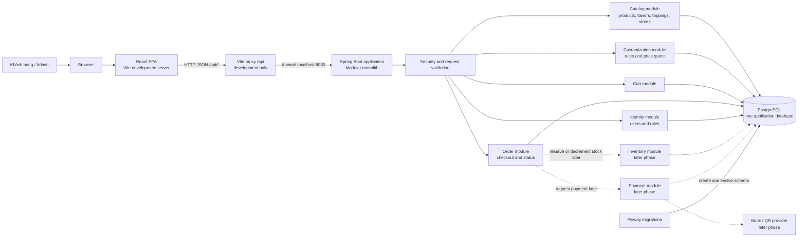
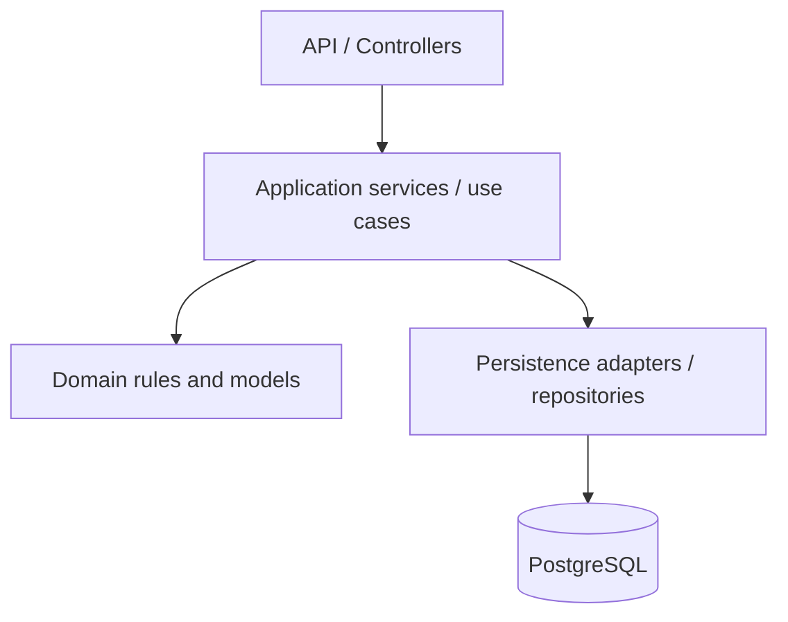
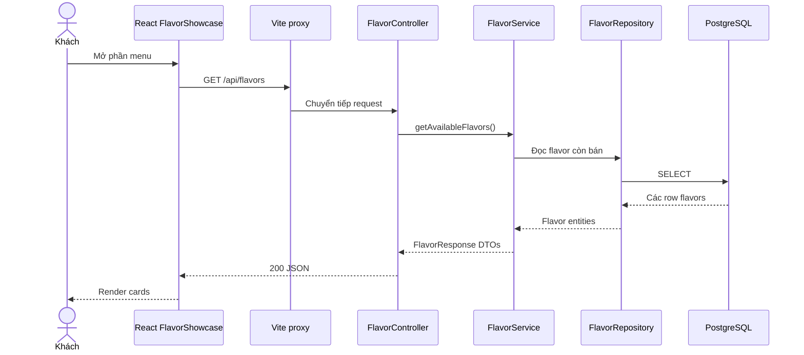
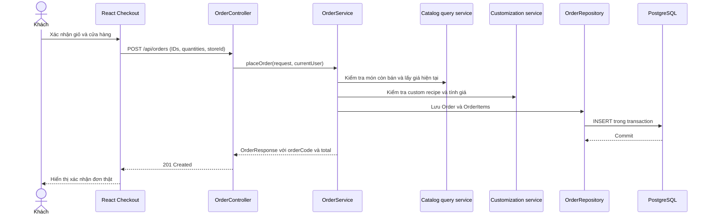

# Kiến trúc hệ thống Crème — Modular Monolith

Tài liệu này là kiến trúc mục tiêu để phát triển project từ landing page hiện tại thành website đặt kem. Thiết kế dựa trên [`todo.md`](todo.md), [`class_diagram.md`](class_diagram.md) và code hiện có.

> Đây là một bản thiết kế để triển khai dần. Các module như cart, order, identity, inventory và payment chưa được code đầy đủ. Không cần tạo tất cả ngay từ đầu.

## 1. Quyết định kiến trúc

Project dùng **modular monolith**:

- Một frontend React SPA.
- Một backend Spring Boot có nhiều module nghiệp vụ trong cùng ứng dụng.
- Một PostgreSQL database do backend quản lý.
- Frontend gọi backend qua REST API và JSON.
- Flyway version hóa thay đổi schema.

Các module nằm trong cùng ứng dụng và được deploy cùng nhau. Chúng vẫn có ranh giới code rõ ràng để thay đổi một nghiệp vụ không làm mọi phần phụ thuộc trực tiếp vào nhau. Chưa cần microservices, message broker hay nhiều database.

## 2. Sơ đồ tổng thể



Trong môi trường development, browser tải React từ Vite ở `localhost:3000`; Vite chuyển tiếp các request `/api/*` đến Spring Boot ở `localhost:8080`. Trong production, có thể phục vụ frontend và API cùng một domain: reverse proxy phục vụ file tĩnh của React, rồi chuyển `/api/*` sang Spring Boot.

## 3. Thành phần và trách nhiệm

| Thành phần | Trách nhiệm | Công nghệ hiện tại |
|---|---|---|
| Frontend | Hiển thị trải nghiệm, quản lý trạng thái giao diện, gửi request và hiển thị kết quả | React 19, TypeScript, Vite |
| API | Hợp đồng giao tiếp giữa browser và backend | REST, JSON, `/api/...` |
| Backend modules | Quy tắc nghiệp vụ, xác thực request, điều phối use case | Spring Boot, Spring MVC, Spring Security, Bean Validation |
| Persistence | Ánh xạ Java và database, truy vấn dữ liệu | Spring Data JPA, Hibernate |
| Schema migration | Tạo và thay đổi schema theo version | Flyway |
| Database | Lưu catalog, người dùng, giỏ hàng và đơn | PostgreSQL |
| API documentation | Mô tả endpoint và hỗ trợ gọi thử khi phát triển | springdoc / Swagger UI |

## 4. Ranh giới module backend

Tổ chức theo nghiệp vụ. Mỗi module sở hữu các use case và dữ liệu của nó. Bên trong module vẫn chia API, application/service, domain và persistence.

```text
backend/src/main/java/com/creme/
├── BackendApplication.java
├── shared/
│   ├── api/                  # lỗi API chung, response lỗi
│   └── config/               # cấu hình dùng chung thực sự
├── security/                 # authentication, authorization
├── catalog/
│   ├── flavor/
│   │   ├── api/               # FlavorController, FlavorResponse
│   │   ├── application/       # FlavorService/use cases
│   │   ├── domain/            # Flavor
│   │   └── persistence/       # FlavorRepository
│   ├── topping/               # cùng cấu trúc khi triển khai
│   ├── product/
│   └── store/
├── customization/
│   ├── api/
│   ├── application/           # validate selection, quote price
│   ├── domain/                # recipe, size, customization rules
│   └── persistence/
├── cart/
│   ├── api/
│   ├── application/
│   ├── domain/
│   └── persistence/
├── order/
│   ├── api/
│   ├── application/           # place order, change order status
│   ├── domain/                # Order, OrderItem, OrderStatus
│   └── persistence/
├── identity/
│   ├── api/
│   ├── application/
│   ├── domain/                # User, Role
│   └── persistence/
├── inventory/                 # giai đoạn vận hành
└── payment/                   # sau khi chốt provider/phương thức trả tiền
```

### note about module backend
#### catalog
Trong catalog, các phần đều là dữ liệu mà khách có thể xem trước khi đặt hàng:
flavor/: các hương vị kem, ví dụ vanilla, chocolate, matcha.
topping/: các phần thêm, ví dụ cookie, hạnh nhân, sốt caramel.
product/: các món hoàn chỉnh được bán trong menu, ví dụ:
- Chocolate Sundae
- Matcha Cookie Cup
- Combo 2 viên kem
store/: thông tin cửa hàng để khách chọn nơi nhận hoặc pickup:
- tên cửa hàng
- địa chỉ
- giờ mở cửa
- trạng thái đang hoạt động
- số điện thoại hoặc tọa độ bản đồ

``` text
Flavor  = thành phần hương vị
Topping = thành phần thêm
Product = món hoàn chỉnh trong menu
Store   = nơi bán hoặc nhận món
```

Catalog → Customization → Cart → Order
              ↑
          Identity

#### customization
This handles a customer’s custom ice cream choices.
Base: Vanilla
Extra flavors: Chocolate, Strawberry
Toppings: Oreo, Caramel
Size: Large

Its responsibilities:

Validate selection limits, such as maximum 2 extra flavors or 3 toppings.
Check whether flavors and toppings are available.
Calculate the price quote.
Represent the custom recipe.
It answers: “What did the customer build, and is it valid?”

It does not save the final purchase yet.

### The cart is the customer’s temporary shopping list before checkout.
The cart is the customer’s temporary shopping list before checkout.
1 × Matcha Cookie Cup
1 × Custom Vanilla Ice Cream
Its responsibilities:

Add or remove items.
Change quantities.
Store the current customer’s selections.
Calculate an estimated subtotal.
Keep items while the customer continues shopping.
It answers: “What does the customer currently intend to buy?”

### order
An order is created when the customer confirms checkout.

Its responsibilities:

Validate the cart again.
Check current availability and prices.
Save the purchase permanently.
Store order items and price snapshots.
Track status, such as:
PENDING → CONFIRMED → PREPARING → READY → COMPLETED
It answers: “What purchase did the customer actually submit?”

The backend must calculate the final price again. It should not trust a totalPrice sent by the frontend.

### identity
Identity handles who the customer or administrator is.
Its responsibilities:

Register and authenticate users.
Identify the current customer.
Manage roles, such as CUSTOMER and ADMIN.
Control access to carts, orders, and admin APIs.
Store account information.
It answers: “Who is making this request?”
For example:

Anyone can view flavors and stores.
A customer can access their own cart and orders.
An admin can manage products and update order status.

simple example:

Catalog:
  Vanilla flavor costs $3

Customization:
  Customer chooses Vanilla + Oreo topping
  Backend calculates quote: $4

Cart:
  Customer adds that custom ice cream

Order:
  Customer confirms checkout
  Backend saves the order at $4
  Order status becomes PENDING

Identity:
  Backend knows which customer owns the cart and order


### Quy tắc phụ thuộc



- Controller nhận request, chạy validation đầu vào cơ bản, gọi application service và trả DTO.
- Application service phối hợp nghiệp vụ và transaction.
- Domain mô tả khái niệm, trạng thái và quy tắc cốt lõi.
- Persistence chỉ xử lý đọc/ghi database.
- Module khác không nên gọi thẳng repository hoặc sửa entity nội bộ của module này. Module giao tiếp qua service/use case công khai và DTO/ID cần thiết.
- Không tạo `shared` cho mọi thứ. Chỉ đặt ở đó những thành phần thật sự dùng chung, như định dạng lỗi API.

Với code đang học và quy mô hiện tại, không cần xây một framework abstraction riêng. Có thể giữ cấu trúc Controller/Service/Repository/Entity/DTO đang có cho `Flavor`, rồi chuyển nhóm lớp sang `catalog` khi thêm module thứ hai hoặc thứ ba.

## 5. Quy ước domain

- `Flavor`: lựa chọn hương vị dùng làm base hoặc flavor phối thêm.
- `Topping`: phần thêm, có category, giá thêm và trạng thái còn bán.
- `Product`: món signature hoàn chỉnh trong menu. Chỉ cần tách khỏi `Flavor` khi có khác biệt nghiệp vụ rõ ràng.
- `CustomIceCream`: lựa chọn khách tạo; có một base, tối đa hai flavor thêm, tối đa ba topping và một size theo bản nháp.
- `Cart`: lựa chọn đang sửa trước khi gửi đơn.
- `Order`: giao dịch đã được gửi đi, có trạng thái và dữ liệu giá tại thời điểm mua.
- `Store`: nơi pickup.
- `User`: tài khoản khách hàng hoặc admin. Xác định sớm MVP có yêu cầu đăng nhập hay cho đặt guest; hai luồng này ảnh hưởng đến cách định danh Cart.

Hiện `Flavor` được dùng làm card trong menu. Giữ nó trong MVP để không thiết kế quá mức. Khi có món signature gồm nhiều component flavor/topping, thêm `Product` và recipe riêng. Xem chi tiết class và quan hệ ở [`class_diagram.md`](class_diagram.md).

## 6. Luồng request

### 6.1 Đọc menu



Đây là luồng đã có: `FlavorShowcase` gọi `getFlavors()`; backend có `FlavorController`, `FlavorService`, `FlavorRepository`, `Flavor` và `FlavorResponse`; Flyway tạo bảng bằng `V1__create_flavors.sql`.

### 6.2 Đặt order mục tiêu



Một đơn phải được tạo trong transaction: hoặc order và các order items đều lưu, hoặc không lưu phần nào. Backend lấy giá từ catalog và tính lại; frontend không quyết định giá cuối cùng.

## 7. API design

Giữ API JSON dưới tiền tố `/api`. Dùng DTO riêng cho request/response, không nhận hoặc trả trực tiếp JPA entity.

| Nhóm | Endpoint mục tiêu | Truy cập |
|---|---|---|
| Catalog | `GET /api/flavors`, `GET /api/toppings`, `GET /api/products`, `GET /api/stores` | Public |
| Customization | `POST /api/custom-ice-creams/quote` | Public hoặc theo chính sách sản phẩm |
| Cart | `GET /api/cart`, `POST /api/cart/items`, `DELETE /api/cart/items/{id}` | User hiện tại hoặc guest session đã chọn |
| Order | `POST /api/orders`, `GET /api/orders/{code}` | Chủ đơn/admin hoặc cơ chế tra cứu bảo vệ |
| Admin | `/api/admin/**` | Role `ADMIN` |

Quy ước response:

- `200 OK` khi lấy dữ liệu thành công.
- `201 Created` khi tạo order.
- `400 Bad Request` khi request không hợp lệ.
- `401 Unauthorized` khi thiếu đăng nhập cho endpoint cần user.
- `403 Forbidden` khi user không đủ quyền.
- `404 Not Found` khi tài nguyên không tồn tại hoặc không thể truy cập.
- `409 Conflict` cho trạng thái xung đột, ví dụ hết hàng tại lúc xác nhận.
- Một định dạng lỗi JSON thống nhất nên có `timestamp`, `status`, `code`, `message` và lỗi field validation nếu có.

Không nhận `totalPrice` làm giá đáng tin cậy từ browser. Request gửi IDs, size và quantity; backend kiểm tra, định giá, rồi trả lại tổng tiền đã tính.

## 8. Frontend architecture

Giữ React SPA. Tổ chức code theo feature khi luồng mới được thêm:

```text
frontend/src/
├── app/                       # composition, route setup nếu cần
├── api/
│   ├── client.ts              # fetch wrapper, error parsing
│   └── ...                    # endpoint functions
├── features/
│   ├── catalog/               # flavor/topping list và API state
│   ├── custom-builder/        # cấu hình kem và quote
│   ├── cart/
│   ├── checkout/
│   ├── account/               # khi có authentication
│   └── admin/                 # giai đoạn vận hành
├── components/                # component trình bày dùng chung
├── config/                    # brand palette, animation settings
├── types/                     # shared frontend/API types
└── utils/
```

- `App.tsx` có thể giữ vai trò composition cho landing page hiện tại.
- Khi thêm `/menu`, `/cart`, `/checkout`, `/account`, thêm router và page-level components; các feature không nên phình hết vào `App.tsx`.
- `api/client.ts` gom xử lý base URL, lỗi HTTP và auth token/cookie. Mỗi feature giữ các hàm gọi endpoint của mình.
- Loading, empty, success và error là các trạng thái giao diện cần hiển thị rõ.
- Ảnh sequence, Lenis và hiệu ứng thuộc presentation layer. Chúng không gọi database hoặc tính giá order.
- UI có thể giữ màu thương hiệu/metadata trang trí. Giá, availability, topping options và trạng thái order lấy từ API làm nguồn nghiệp vụ chuẩn.

Code hiện đã được sắp xếp theo feature: `features/catalog`, `features/custom-builder`, `features/checkout` và `features/stores`. `FlavorShowcase` gọi API; `toProductFlavor()` ghép dữ liệu API với `FLAVOR_LIST` để lấy metadata thiết kế. Có thể giữ cách này trong giai đoạn chuyển tiếp. Khi backend cung cấp đủ trường nghiệp vụ cần thiết, bỏ phần dữ liệu trùng lặp theo từng trường, nhưng vẫn giữ palette/animation ở frontend.

## 9. PostgreSQL, JPA và Flyway

- PostgreSQL là nguồn dữ liệu cho business state.
- Mọi thay đổi schema đi bằng migration Flyway mới: `V2__...sql`, `V3__...sql`.
- Không sửa migration đã áp dụng trên database dùng chung; migration kế tiếp mô tả thay đổi mới.
- `spring.jpa.hibernate.ddl-auto=validate` giữ vai trò phát hiện lệch giữa entity và schema. Hibernate không tạo schema.
- Dùng `BigDecimal` trong Java và `NUMERIC/DECIMAL` trong PostgreSQL cho tiền.
- Tạo foreign key, unique constraints, not-null và check constraints cho các bất biến mà database có thể bảo vệ.
- Đặt index cho khóa ngoại và field thường dùng để lọc/tìm kiếm sau khi endpoint/query cụ thể xuất hiện.
- Order items lưu snapshot tên, lựa chọn và unit price tại thời điểm đặt.
- Tránh nhét mọi danh sách vào một chuỗi delimiter. Dùng bảng quan hệ cho flavor/topping lựa chọn khi cần truy vấn hoặc kiểm tra quan hệ.

## 10. Security và cấu hình môi trường

Đặt policy rõ ràng cho từng endpoint: catalog public, customer endpoints yêu cầu user phù hợp, admin yêu cầu role admin. Không để cấu hình mặc định Spring Security tạo user/password demo trở thành cơ chế đăng nhập sản phẩm.

Chọn một kiểu xác thực khi triển khai:

- **Session cookie**: phù hợp khi frontend/backend cùng site; bật và xử lý CSRF cho request thay đổi dữ liệu.
- **Token stateless**: dùng khi có lý do cần token; phải thiết kế lưu token, refresh/revocation và CORS cẩn thận.

Không trộn hai kiểu tùy tiện. Cấu hình DB password qua environment/local secret, không commit vào properties. `application.properties` giữ URL/port và placeholders. `.env` không tự được Spring Boot đọc nếu không có bước nạp.

Hiện `SecurityConfig` cho phép `/api/flavors` và Swagger; hãy cập nhật allowlist theo endpoint catalog mới. Cấu hình CSRF cần đi cùng kiểu xác thực đã chọn; không bỏ CSRF toàn bộ API chỉ để request từ frontend chạy được.

## 11. Transaction, giá và tồn kho

- Đặt transaction ở application/service use case, không ở controller.
- Tạo order, order items, liên kết pickup/payment state cần nhất quán trong một transaction.
- Sau khi thêm inventory, xử lý cạnh tranh lúc kiểm tra và trừ hàng. Đừng dựa vào quy trình `đọc số lượng → nếu đủ thì trừ` không khóa trong các request đồng thời.
- Bắt đầu bằng database transaction và constraint phù hợp; thêm `@Version` optimistic locking hoặc row locking khi có use case và test thể hiện cần thiết.
- Payment provider là tích hợp ngoài. Ghi lại reference/status và xử lý callback/webhook idempotent; không đánh dấu PAID chỉ vì frontend nói thanh toán thành công.
- Thêm idempotency key cho submit order/payment khi cần xử lý double-click, retry mạng và webhook lặp.

## 12. Logging, errors và observability

- Trả lỗi API có cấu trúc; không trả stack trace hoặc thông tin database cho client.
- Ghi log server với request ID/order code để theo dõi một thao tác qua các lớp.
- Không log password, token, card/bank secret hoặc toàn bộ thông tin cá nhân.
- Bắt đầu với Spring Boot logs và health check cơ bản. Metrics/tracing tập trung chỉ thêm khi deploy hoặc cần chẩn đoán thực tế.

## 13. Kiểm thử theo tầng

- Unit test cho quy tắc chọn flavor/topping, tính giá và trạng thái order.
- MVC/API test cho status, JSON contract, validation và access control.
- Persistence/integration test cho migration Flyway, JPA mapping và transaction.
- Khi bắt đầu dùng CI hoặc muốn test độc lập môi trường local, dùng Testcontainers với PostgreSQL.
- Frontend kiểm tra trạng thái loading/error và cách submit request khi các feature có logic tương ứng.

## 14. Lộ trình triển khai

### Phase 0 — Baseline đang có

- Spring Boot, PostgreSQL, Flyway migration `V1__create_flavors.sql`.
- `GET /api/flavors` qua controller/service/repository/entity/DTO.
- React `FlavorShowcase` gọi API qua Vite proxy.

### Phase 1 — Catalog hoàn chỉnh

- Thêm topping và store endpoints; thay dữ liệu tĩnh nghiệp vụ trong builder/locator.
- Chốt tên/category/availability/pricing fields và chính sách public catalog.
- Đồng bộ giới hạn topping giữa UI và backend. Bản nháp nói tối đa 3; `ToppingBuilder` hiện cho tối đa 4.

### Phase 2 — Customization và checkout

- Thêm API quote cho custom ice cream.
- Tính giá và xác thực lựa chọn ở backend.
- Xây cart/checkout/order với DTO, transaction, status và snapshot giá.
- Thay mã order random trong `OrderModal` bằng order code trả từ server.

### Phase 3 — Identity và admin

- Chốt đặt guest hay bắt buộc tài khoản; implement security cho API theo policy.
- Thêm role admin, quản lý menu/order và order history.

### Phase 4 — Business operations

- Inventory, address/delivery, coupon, review và order tracking.
- Thêm locking/concurrency control cho hàng tồn sau khi có quy tắc kho rõ ràng.

### Phase 5 — Premium features

- Saved creations, flavor pairing, recommendations, loyalty và 3D preview.
- Tích hợp thanh toán QR/ngân hàng sau khi đã chốt provider và luồng xác nhận thanh toán.

## 15. Nguyên tắc giữ kiến trúc gọn

1. Bắt đầu từng vertical slice: migration → backend API → frontend feature.
2. Giữ module trong cùng Spring Boot app và cùng PostgreSQL cho đến khi có nhu cầu vận hành thật sự chứng minh cần tách.
3. Giữ một nguồn dữ liệu chuẩn cho từng business field.
4. Giữ quy tắc giá, trạng thái, availability và giới hạn lựa chọn ở backend.
5. Giữ API contract bằng DTO; frontend không phụ thuộc trực tiếp vào tên class/entity JPA.
6. Thêm abstraction sau khi có ít nhất một use case cụ thể cần nó.
7. Cập nhật diagram và migration cùng lúc khi quyết định domain thay đổi.

## 16. Liên kết tài liệu

- [`todo.md`](todo.md): mục tiêu sản phẩm và danh sách tính năng.
- [`class_diagram.md`](class_diagram.md): entity, quan hệ, service và endpoint gợi ý.
- [`flavors-flow.md`](flavors-flow.md): chi tiết luồng flavor đã nối PostgreSQL → Spring Boot → React.
- [`dependencies.md`](dependencies.md): chức năng dependency trong `pom.xml`.
