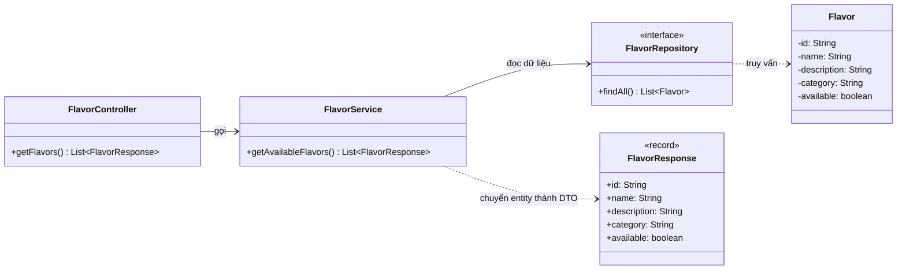
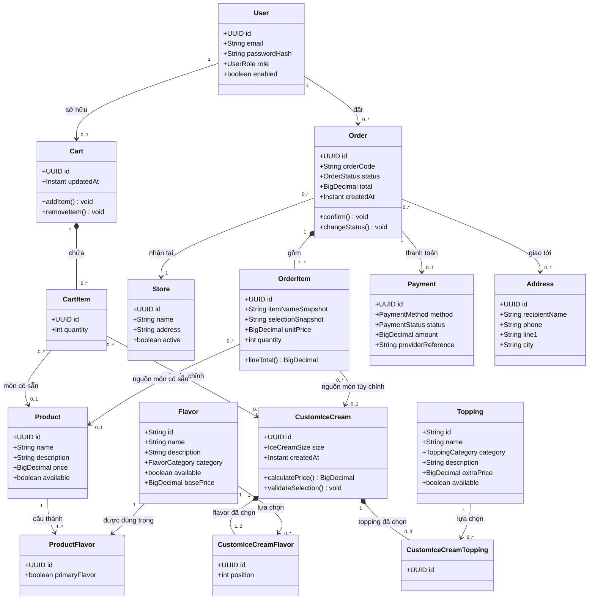
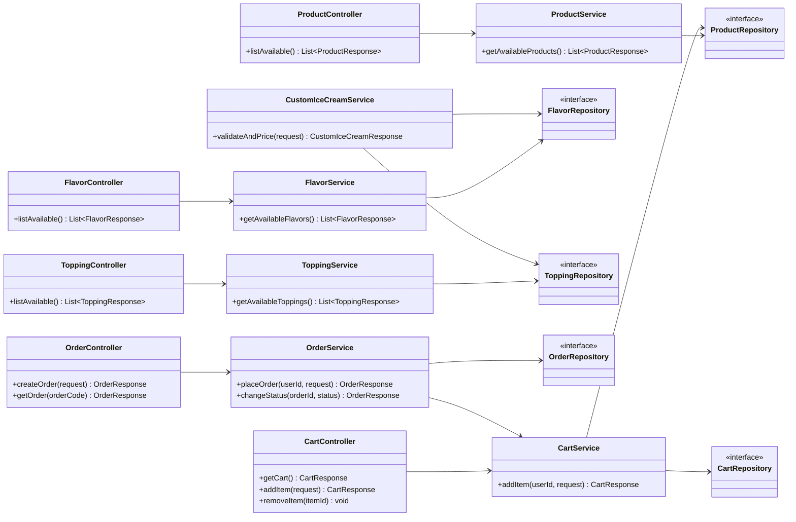

# Backend class diagram — Crème

Tài liệu này phát triển bản nháp [`todo.md`](todo.md) thành thiết kế backend có thể triển khai theo từng giai đoạn. Đây là **thiết kế mục tiêu**, không có nghĩa mọi lớp trong sơ đồ đã tồn tại trong code.

## 1. Trạng thái hiện tại

Backend đã có vertical slice đầu tiên cho danh sách flavor:



Luồng này nằm ở `backend/src/main/java/com/creme/catalog/flavor/api/FlavorController.java`, `backend/src/main/java/com/creme/catalog/flavor/application/FlavorService.java`, `backend/src/main/java/com/creme/catalog/flavor/persistence/FlavorRepository.java`, `backend/src/main/java/com/creme/catalog/flavor/domain/Flavor.java` và `backend/src/main/java/com/creme/catalog/flavor/api/FlavorResponse.java`. Migration `V1__create_flavors.sql` tạo bảng `flavors` và dữ liệu mẫu; API hiện tại là `GET /api/flavors`.

Các lớp trong phần còn lại của tài liệu là **đề xuất cho những bước tiếp theo**.

## 2. Quy ước miền nghiệp vụ

Để tránh các lớp trùng nghĩa, thiết kế dùng các khái niệm sau:

- **Flavor**: lựa chọn hương vị có thể dùng làm base hoặc thêm vào kem. Ví dụ vanilla, matcha, chocolate.
- **Topping**: phần thêm như waffle, honeycomb, sauce. Mỗi topping có loại, giá thêm và trạng thái còn bán.
- **Product**: món signature đã định nghĩa sẵn trong menu, có tên, mô tả và giá bán. Product có thể tham chiếu một hoặc nhiều Flavor.
- **CustomIceCream**: công thức khách tự chọn: một base, tối đa hai flavor bổ sung, tối đa ba topping và một size.
- **Cart / Order**: Cart còn có thể chỉnh sửa; Order là giao dịch đã được gửi đi và cần giữ lại thông tin giá tại thời điểm mua.

Trong code hiện tại, `Flavor` đang cung cấp các thẻ kem hiển thị trong menu. Có thể tiếp tục dùng nó cho MVP. Chỉ tách thêm `Product` khi cần phân biệt rõ món bán sẵn với nguyên liệu flavor có thể phối trong kem tự tạo.

## 3. Domain model cho luồng MVP

Sơ đồ này tập trung vào menu, tùy chỉnh kem, giỏ hàng và đặt pickup. `Address` có thể để giai đoạn sau nếu MVP chỉ nhận hàng tại cửa hàng.



### Ràng buộc quan trọng

- `CartItem` phải tham chiếu **đúng một** trong hai loại: `Product` hoặc `CustomIceCream`. Không được để cả hai cùng null hoặc cùng có giá trị. Có thể bắt đầu kiểm tra quy tắc này trong service; về sau bổ sung constraint phù hợp ở database.
- `CustomIceCream` phải có đúng một base flavor. Trong sơ đồ, các lựa chọn flavor biểu diễn tối đa hai flavor bổ sung; nếu muốn dùng chung bảng cho base, có thể thêm `selectionType` (`BASE` hoặc `EXTRA`) vào `CustomIceCreamFlavor` và bắt buộc có đúng một `BASE`.
- Quy tắc số lượng cần được xác nhận với giao diện hiện tại: `todo.md` nói tối đa 3 topping, trong khi `ToppingBuilder.tsx` hiện cho chọn tối đa 4. Chọn một giới hạn thống nhất; backend phải là nơi kiểm tra cuối cùng.
- `OrderItem.unitPrice`, `itemNameSnapshot` và `selectionSnapshot` lưu dữ liệu tại lúc đặt hàng. Nếu giá hoặc tên món trong menu thay đổi sau này, lịch sử đơn vẫn đúng.
- `Order.total` được backend tính từ các `OrderItem`; không nhận tổng tiền do frontend tự tính làm giá trị có thẩm quyền.
- Tiền nên dùng `BigDecimal` trong Java và `NUMERIC/DECIMAL` trong PostgreSQL, không dùng `float` hoặc `double` cho phép tính giá.
- `Payment` chỉ cần lưu trạng thái và phương thức trong MVP. Tích hợp QR/ngân hàng cần thêm provider/service riêng ở giai đoạn sau; tuyệt đối không lưu thông tin bí mật thẻ/ngân hàng tùy tiện.

## 4. Các lớp tầng ứng dụng dự kiến



Controller nhận HTTP request và trả DTO; service thực hiện nghiệp vụ; repository truy cập dữ liệu. Controller không nên tự viết quy tắc giá hoặc truy cập database trực tiếp.

Các request/response DTO có thể là Java `record`, ví dụ `CreateOrderRequest`, `OrderResponse`, `FlavorResponse`. Không nhận entity JPA trực tiếp từ người dùng và không trả entity trực tiếp ra JSON.

## 5. Enum đề xuất

Các giá trị trạng thái nên là enum thay vì chuỗi tự do:

```text
UserRole: CUSTOMER, ADMIN
FlavorCategory: SIGNATURE, SEASONAL, DAIRY_FREE
ToppingCategory: CRUNCH, SAUCE, FRUIT, SPECIALTY
IceCreamSize: SMALL, REGULAR, LARGE
OrderStatus: PENDING, CONFIRMED, PREPARING, READY, DELIVERED, CANCELLED
PaymentMethod: PAY_AT_STORE, BANK_TRANSFER, QR
PaymentStatus: UNPAID, PENDING, PAID, FAILED, REFUNDED
```

Tên enum có thể khác cách viết label trên giao diện. Ví dụ API trả `DAIRY_FREE`, frontend hiển thị `Dairy-Free`.

## 6. API contract gợi ý

Các endpoint công khai cho catalog:

| Method | Endpoint | Mục đích |
|---|---|---|
| `GET` | `/api/flavors` | Liệt kê flavor đang bán. Đã có trong code. |
| `GET` | `/api/toppings` | Liệt kê topping đang bán. |
| `GET` | `/api/products` | Liệt kê món signature có sẵn. |
| `POST` | `/api/custom-ice-creams/quote` | Kiểm tra lựa chọn và tính giá tạm tính ở server. |

Endpoint yêu cầu người dùng/đơn hàng:

| Method | Endpoint | Mục đích |
|---|---|---|
| `GET` | `/api/cart` | Xem giỏ của người dùng hiện tại. |
| `POST` | `/api/cart/items` | Thêm món có sẵn hoặc món tùy chỉnh vào giỏ. |
| `DELETE` | `/api/cart/items/{itemId}` | Xóa một dòng trong giỏ. |
| `POST` | `/api/orders` | Tạo order từ giỏ và thông tin nhận hàng. |
| `GET` | `/api/orders/{orderCode}` | Tra cứu trạng thái đơn theo quyền truy cập phù hợp. |

Ví dụ body đặt hàng chỉ nên gửi lựa chọn và số lượng, không gửi giá có thẩm quyền:

```json
{
  "storeId": "store-1",
  "items": [
    {
      "productId": null,
      "customIceCream": {
        "baseFlavorId": "vanilla-gold",
        "flavorIds": ["dark-chocolate-crunch"],
        "toppingIds": ["waffle-bites", "honeycomb"],
        "size": "REGULAR"
      },
      "quantity": 2
    }
  ]
}
```

Backend xác thực ID, trạng thái còn bán, giới hạn số lựa chọn, tồn kho (khi đã triển khai), rồi tính giá và lưu order trong một transaction.

## 7. Phân chia theo phase

### Giai đoạn A — Catalog và tích hợp giao diện

- Giữ cấu trúc đã có cho `Flavor` và `GET /api/flavors`.
- Thêm `Topping` và `GET /api/toppings`.
- Chọn một nguồn dữ liệu cho từng trường: database/API hoặc hằng số giao diện; tránh để giá và trạng thái còn bán bị định nghĩa ở cả hai nơi.
- Cấu hình frontend gọi backend qua Vite proxy hoặc CORS.

### Giai đoạn B — Tùy chỉnh, cart và order MVP

- Thêm `Product` nếu thực sự cần món signature khác với lựa chọn flavor.
- Thêm `CustomIceCream`, các lớp lựa chọn, `Cart`, `CartItem`, `Order`, `OrderItem`, `Store`.
- Tạo `CustomIceCreamService` để xác thực lựa chọn và tính giá.
- Tạo đơn bằng `@Transactional`; chụp giá/tên món vào `OrderItem`.
- Thêm xác thực và phân quyền theo nhu cầu. Catalog có thể public; endpoint giỏ hàng và tài khoản cần xác định danh tính khách hàng.

### Giai đoạn C — Tính năng vận hành

- `Address`, lịch sử đơn, theo dõi trạng thái, admin.
- `InventoryItem` và `InventoryMovement` để quản lý lượng tồn và lịch sử thay đổi.
- `@Version` trên bản ghi tồn kho hoặc cơ chế khóa phù hợp khi có nhiều đơn đồng thời.
- Coupon và review chỉ thêm khi có use case rõ ràng.

### Giai đoạn D — Tính năng nâng cao

- `SavedCreation` để lưu công thức khách yêu thích.
- `FlavorPairing` để lưu quan hệ gợi ý giữa hai flavor và điểm phù hợp.
- Recommendation/loyalty/3D preview không cần làm trước khi luồng mua cơ bản hoạt động.

## 8. Ghi chú triển khai

- Tạo bảng và thay đổi schema bằng migration Flyway `V2__...sql`, `V3__...sql`; không sửa migration đã chạy trên database dùng chung.
- Giữ `spring.jpa.hibernate.ddl-auto=validate` để Hibernate báo lệch giữa entity và schema.
- Đặt các lớp dưới package gốc `com.creme` để Spring Boot component scan tìm thấy.
- Khi entity có quan hệ hai chiều, tránh serialize entity trực tiếp thành JSON; dùng DTO để tránh vòng lặp JSON và không vô tình lộ trường nội bộ.
- Dùng `@Transactional` ở service cho thao tác đặt hàng gồm nhiều lần đọc/ghi cần thành công hoặc rollback cùng nhau.
- Chưa cần triển khai tất cả class trong sơ đồ để dùng được diagram. Tiến hành theo phase và cập nhật diagram khi quyết định domain thay đổi.
