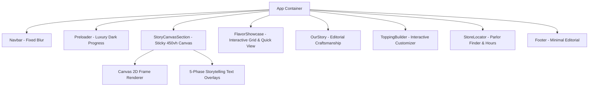

# Implementation Plan - Premium Artisanal Ice Cream Landing Page

A world-class, Awwwards-level landing page for a premium artisanal ice cream brand, powered by a scroll-linked 300-frame image sequence (`ezgif-2377d95cf8ce88e2-jpg/`), HTML5 Canvas frame rendering engine, cinematic storytelling, and interactive commercial sections.

---

## Goal Description

Build a high-performance, visually captivating landing page where the central experience is driven by the sequence of 300 JPG frames in `ezgif-2377d95cf8ce88e2-jpg/`. As the user scrolls through a 450vh sticky section, frames progress seamlessly from top-down ingredient geometry through floating toppings and churning cream, culminating in the assembled hero ice cream cone.

The design adheres strictly to:
- **Cinematic Dark Palette**: Deep black (`#050505`), Cream (`#FFF4DE`), Caramel Waffle (`#C98A48`), Rich Chocolate (`#5A2E22`), Raspberry (`#E94362`), and Pistachio (`#9FBC69`).
- **Seamless Canvas Rendering**: HTML5 Canvas 2D drawing to prevent DOM reflows, image flickering, white flashes, or frame gaps.
- **Zero Video / AI Assets**: Uses *only* the existing 300 JPG frames in exact numerical order.
- **Fluid Responsiveness**: `contain` canvas scaling to keep the ice cream cone fully visible on all screen sizes (desktop, tablet, mobile).
- **Accessible & Performance-Minded**: Strategic progressive image preloader, `prefers-reduced-motion` support, touch-friendly CTAs, and graceful fallbacks.

---

## User Review Required

> [!IMPORTANT]
> **Brand Name & Content Policy**: Since no existing brand name or product dataset was found in the workspace, we will use **CREMA** (with configurable `[BRAND NAME]` placeholders in `src/config/brand.ts`). All flavor profiles (Vanilla, Chocolate, Berry, Pistachio) strictly mirror the real ingredients visible in the sequence frames.

> [!NOTE]
> **Frame Sequence Range**: The folder `ezgif-2377d95cf8ce88e2-jpg/` contains 300 frames (`ezgif-frame-001.jpg` to `ezgif-frame-300.jpg`). We will dynamically calculate scroll progress across all available 300 frames for complete sequence coverage.

---

## Open Questions

- None at present. All requirements, visual palettes, and storytelling beats align with the prompt specification.

---

## Proposed Architecture & Component Design



---

## Proposed Changes

### Tech Stack & Dependencies
- **React 18 / 19 + TypeScript + Vite**
- **Tailwind CSS v3/v4** + **Lucide React** (Icons)
- **GSAP + ScrollTrigger** (Frame & overlay scroll synchronization)
- **Lenis** (Butter-smooth scroll physics)

---

### File Structure Overview

#### [NEW] `package.json`, `vite.config.ts`, `tsconfig.json`, `tailwind.config.js`
Standard Vite + React + Tailwind + GSAP project configuration.

#### [NEW] `src/config/brand.ts`
Centralized brand configuration with fallback `[BRAND NAME]` support:
```typescript
export const BRAND_CONFIG = {
  name: "CREMA",
  tagline: "Artisanal Soft Serve & Craft Waffles",
  placeholderBrand: "[BRAND NAME]",
  colors: {
    bgPrimary: "#050505",
    bgSecondary: "#0B0B0B",
    vanillaCream: "#FFF4DE",
    caramelWaffle: "#C98A48",
    chocolate: "#5A2E22",
    raspberry: "#E94362",
    pistachio: "#9FBC69",
  }
};
```

#### [NEW] `src/components/Preloader.tsx`
- Screen overlay displaying progressive frame loading percentage.
- Smooth radial progress indicator and editorial tagline: *"Handcrafting your experience..."*.
- Fades out cleanly once initial keyframes are cached.

#### [NEW] `src/components/Navbar.tsx`
- Slim fixed navigation bar.
- Transparent at `scrollTop = 0`; transitions to semi-transparent `#050505` with `backdrop-filter: blur(12px)` on scroll.
- Navigation items: `Home`, `Flavors`, `Our Story`, `Stores`, and `Order Now` CTA.
- Mobile menu drawer with smooth toggle animation.

#### [NEW] `src/components/StoryCanvasSection.tsx`
- Sticky `450vh` container with a full-viewport `<canvas>` element.
- **Canvas Rendering Engine**:
  - Pre-decodes frame images onto offscreen buffers to prevent render lag.
  - Device pixel ratio multiplier for ultra-sharp rendering on Retina screens.
  - Responsive `contain` image drawing algorithm preserving 16:9 ratio.
- **Scroll Storytelling Phases**:
  1. **0% - 18% (Frames 1–50)**: Top-Down Ingredient Ring — *"A whole new spin on flavor."*
  2. **18% - 42% (Frames 51–120)**: Churning Cream & Sprinkles — *"Freshness in every swirl."*
  3. **42% - 68% (Frames 121–190)**: Floating Fruits & Nuts — *"Every flavor has a personality."* (Vanilla, Chocolate, Berry, Pistachio badges).
  4. **68% - 88% (Frames 191–245)**: Waffle Cone Formation — *"Smooth. Crisp. Full of surprises."*
  5. **88% - 100% (Frames 300)**: Assembled Hero Cone — *"Happiness starts with one scoop."* with CTAs: **Order Now** & **Explore Flavors**.

#### [NEW] `src/components/FlavorShowcase.tsx`
- Grid of artisanal flavors:
  - **Madagascar Vanilla Swirl** (Classic, Smooth)
  - **Dark Chocolate Waffle Crunch** (Rich 70% Cocoa, Honeycomb)
  - **Wild Raspberry Ribbon** (Bright Berry, Tart & Sweet)
  - **Pistachio Matcha Dream** (Earthy, Creamy Nut)
- Interactive product cards with modal preview for ingredient details & taste profile.

#### [NEW] `src/components/OurStory.tsx`
- Editorial side-by-side layout highlighting artisanal dairy, slow churning, and daily waffle baking.

#### [NEW] `src/components/ToppingBuilder.tsx`
- Interactive visual selector for custom toppings (Golden Waffle Crunch, Honeycomb Bites, Fresh Berries, Dark Chocolate Drizzle, Sprinkles).

#### [NEW] `src/components/StoreLocator.tsx`
- Parlor locator card with store hours and order pickup options.

#### [NEW] `src/components/Footer.tsx`
- Minimal editorial footer with logo, links, copyright, and social links.

---

## Verification Plan

### Automated Tests
1. **TypeScript & Build Verification**:
   ```bash
   npm run build
   ```
   Ensures zero build errors, type mismatches, or missing exports.

2. **Asset Validation**:
   - Verify all 300 frames in `ezgif-2377d95cf8ce88e2-jpg/` load cleanly without 404 errors.

### Manual Verification
1. **Scroll Synchronization & Motion**:
   - Scroll slowly and quickly through the 450vh storytelling section to verify smooth 60fps frame transition without white flashes or frame gaps.
2. **Responsive Canvas & Scaling**:
   - Test across Desktop (1920x1080, 1440x900), Tablet (768x1024), and Mobile (375x812) viewports to ensure the ice cream cone remains centered and uncropped.
3. **Accessibility**:
   - Enable `prefers-reduced-motion` in browser developer tools to verify static fallback hero behavior.
   - Verify keyboard focus states on all CTA buttons and navigation links.

---
